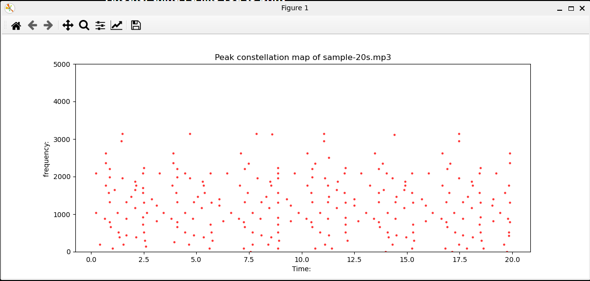

# SoundWave: End-to-End High-Performance Audio Matching Engine

SoundWave is an industrial-strength audio identification system based on the landmark Avery Wang (Shazam) algorithm. Built natively in Python using `NumPy` and `SciPy`, the engine transforms raw, unstructured acoustic streams into space-efficient combinatorial fingerprint hashes, enabling sub-second track retrieval over large catalogs under heavy ambient noise conditions.

---

## System Architecture & Data Workflow

The application is engineered as a decoupled, multi-layer data pipeline that handles unstructured audio ingestion, digital signal processing (DSP) feature extraction, data reduction, and inverted-index search matching.

[Unstructured Audio (.mp3/.wav)]
│
▼ Layer 1: Data Ingestion & Standardization (Stereo -> Mono @ 22.05 kHz)
[Standardized 1D Amplitude Array]
│
▼ Layer 2: Time-Frequency Feature Extraction (Short-Time Fourier Transform)
[2D Spectrogram Matrix]
│
▼ Layer 3: Dimensionality Reduction (2D Local Maxima Filtering)
[Sparse Constellation Map (Peaks)]
│
▼ Layer 4: Combinatorial Hashing (Time-Invariant Anchor-Zone Pairing)
[Cryptographic Fingerprint Hashes]
│
▼ Layer 5: Inverted Index Lookup & Validation (Time-Offset Histogram Alignment)
[Predicted Song Match + Confidence Score]

### 1. Data Ingestion & Standardization (`src/preprocess.py`)
* **Dual-to-Single Channel Mapping:** High-fidelity stereo streams are downmixed to uniform Mono ($1$ channel) to eliminate spatial variance.
* **Nyquist-Constrained Resampling:** Data is mathematically downsampled to a fixed $22,050\text{ Hz}$ sampling rate using linear interpolation. This significantly compresses memory footprint while maintaining a $11,025\text{ Hz}$ frequency boundary—perfectly capturing core musical acoustics.
* **Amplitude Normalization:** Continuous wave sequences are bounded within a $[-1.0, +1.0]$ float scale to eliminate volume-induced scaling biases during extraction.


### 2. Feature Engineering & Time-Frequency Mapping (`src/spectrogram.py`)
* **Windowed Fast Fourier Transform:** The continuous 1D array is sliced into overlapping discrete chunks using a **Hamming Window** to minimize spectral leakage at window boundaries.
* **STFT Generation:** A Short-Time Fourier Transform (STFT) transforms the time-domain signal into the frequency domain, generating a dense 2D Spectrogram matrix mapping time bins ($x$), frequency bins ($y$), and power spectral density ($z$).

### 3. Dimensionality Reduction via Peak Picking (`src/fingerprint.py`)
* **Unsupervised Feature Selection:** To isolate structural audio signatures from background hums and static, an unsupervised **2D Local Maxima Filter** (equivalent to a CNN Max-Pooling layer) scans the spectrogram.
* **Constellation Map Generation:** Data density is drastically compressed ($>95\%$ reduction) by discarding low-energy noise, retaining only high-intensity coordinate points called a *Constellation Map*.


### 4. Combinatorial Hashing (`src/fingerprint.py`)
* **Time-Shift Invariance:** To ensure a query clip can match a song regardless of its start timestamp, peaks are coupled into anchors and target zones.
* **Cryptographic Keys:** Pairs are combined into reproducible hash structures encoded alongside their relative time delta ($\Delta t$), creating highly unique signatures resistant to localized noise injection.

### 5. Matching Engine & Time Alignment (`src/database.py`)
* **Inverted Index Querying:** User queries (e.g., recorded microphone snippets) are converted to hashes instantly and cross-referenced against an optimized hash map database.
* **Time-Offset Histogram Filter:** True matches undergo structural validation. For a candidate track to be predicted valid, the absolute differences between the reference database timestamps ($t_{\text{song}}$) and query clip timestamps ($t_{\text{clip}}$) must line up along a consistent relative diagonal line. The system builds a histogram of these offsets ($\Delta T = t_{\text{song}} - t_{\text{clip}}$); the track with the highest localized peak in the histogram wins.

---

##  Repository Layout

```text
soundwave-matching-engine/
│
├── data/
│   ├── raw/                 # Pristine MP3/WAV reference audio library
│   └── queries/             # Sample recorded audio snippets for validation
│
├── src/
│   ├── __init__.py
│   ├── config.py            # Global variables (Sampling rates, frame sizes, thresholds)
│   ├── preprocess.py        # Layer 1: Signal standardizer and normalization
│   ├── spectrogram.py       # Layer 2: Short-Time Fourier Transform engine
│   ├── fingerprint.py       # Layer 3 & 4: Max-Pooling peaks and hashing pipelines
│   ├── database.py          # Layer 5: Lookups & Time-Alignment matching validation
│   └── pipeline.py          # Bulk ingestion runner to catalog entire directories
│
├── app/
│   ├── backend.py           # FastAPI backend microservice endpoints
│   └── frontend.py          # Streamlit graphical user interface
│
├── requirements.txt         # Project environment dependencies
└── README.md                # System documentation

## Full engine Architecture: 
               SOUNDWAVE ENGINE
──────────────────────────────────────────────

Phase 1
Audio Standardization
────────────────────
MP3
↓
Mono
↓
Resample (22.05 kHz)
↓
Normalize
↓
NumPy Array

──────────────────────────────────────────────

Phase 2
Time → Frequency Transformation
───────────────────────────────
Waveform
↓
STFT
↓
Hamming Window
↓
Spectrogram (dB)

──────────────────────────────────────────────

Phase 3
Feature Extraction
──────────────────
Spectrogram
↓
Maximum Filter
↓
Local Maxima
↓
Background Removal
↓
Constellation Map

──────────────────────────────────────────────

Phase 4
Fingerprint Generation
──────────────────────
Constellation Map
↓
Choose Anchor
↓
Choose Target Zone
↓
Pair Anchor with Targets
↓
Generate Fingerprint Tuples

(anchor_freq,
 target_freq,
 Δt)

↓
Hash Fingerprints

──────────────────────────────────────────────

Phase 5
Search Engine
─────────────
Store Hashes
↓
Index Database
↓
Query Audio
↓
Generate Query Hashes
↓
Lookup
↓
Voting
↓
Best Match